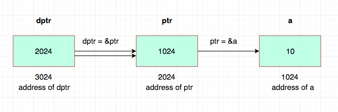

# Advanced Pointers

## Double Pointer (pointer to a pointer)

When a pointer holds the address of another pointer, this is known as a pointer to pointer or double pointer.

In theory, we might also end up with different levels of pointers pointing to other pointers, they are hardly every used and should not be.

A variable that is a pointer to a pointer is declared by placing an additional asterisk in fron of its name
- two asterisks indicate that two levels of pointers are involved



The following declaration declares a pointer to a pointer of type `int`:

```c
int **var;
```

When a value is indirectly pointed to by a pointer, acessing that values requires that the asterisk operator be applied twice.

### Conceptual Example

```c
// declaring a double pointer
int *ipp;

// declaring some ints
int i = 5, j = 6, k = 7;

// initializing some pointers
int *ip1 = &i, *ip2 = %j;

// assigning our double pointer
ipp = &ip1;
```

- `ipp` points to `ip1` which points to `i`
- `*ipp` is `ip1`
- `**ipp` is `i` (5)

### Use Cases

The biggest reason to use a double pointer is when you need to change the value of the pointer passed to a function as the function argument
- simulate pass by reference (remember, everything in C is pass by value/copy)

If you pass a single pointer in as an argument
- you will be modifying local copies of the pointer, not the original pointer in the calling scope
- with a pointer to a pointer, you modify the original pointer

Use a double pointer as an argument to a function when you want to preserve the memory-allocation or assignment even outside of the function.

## Function Pointers

Functions contain addresses and thus, we can use pointers to point to functions
- not as common as other pointer use cases

Pointers to functions can be
- passed to functions
- returned from functions
- stored in arrays
- assigned to other function pointers

A function pointer can be used directly as the function name when calling the function.

They are less error prone than normal pointers because you will never allocate or deallocate memory with them
- you just need to understand what they are and to learn their syntax

### Common Uses of Function Pointers

A function pointer can be used as an argument to another function
- telling the second function which function to use

Sorting an array involves comparing two elements to see which comes first
- the `qsort()` function from the C library is designed to work with arrays of any kind as long as you tell it what function to use to compare elements
- takes a pointer to a function as one of its arguments
- uses that function to sort the type (whether it be integer, string, or structure)

Another common application for function pointers is to create what is known as dispatch tables
- you can create tables that contain pointers to functions to be called
- you might create a table for processing different commands that will be entered by a user
    - each entry in the table could contain both the command name and a pointer to a function to call to process that particular command
    - whenever the user enters a command, you can look up the command inside the table and invoke the corresponding function to handle it

- Menu-driven systems are also a common use of function pointers
- You can use them to replace switch/if-statements
- You can use them to realize you own late-binding
- You can use them to implement callback

Function pointers are useful when alternative functions may be used to perform similar tasks on data.

### Syntax

A pointer to a function stores the address for the start of the function code
- however, the address by itself is not enough information to invoke it
- wee need to know the number and type of the arguments to be supplied and the type of return value to be expected (compiler cannot deduce this information just from the address of the function)

This means that declaring a pointer to a function is going to be a little more complicated than declaring a pointer to a data type. A function pointer holds an address and must also define a prototype.

### Declaration

Function pointers can be declared, assigned values and then used to access the functions they point to.

The declaration for a pointer to a function looks a little strange and can be confusing. When you declare a data pointer, you have to declare the type of data to which it points.

When declaring a function pointer, you have to declare the type of function pointed to
- to specify the function type, you specify the function signature (the return type for the function and the parameter types for a function)

```c
int (*pfunction)(int);
```

This declares a variable that is a pointer to a function
- does not point to anything
- just defines the pointer variable

The parentheses are essential in the declaration because of the operators' precedence
- the declaration without the parentheses `int *pfunction(int)` will declare a function `pfunction` that returns an integer pointer that is not our intention in this case

```c
int (*pfunction)(int);
```

The declaration is the de-referenced value of pfunction (`*pfuncton`).

It points to functions that have one parameter of type int and that return a vlaue of type int to the calling function
- you can only use this particular pointer to point to functions with these parameters and return value

If you want a pointer to functions that accepts a float argument and returns float values
- you need to declare another pointer with the required characteristics

### Assignment

```c
int (*pfunction)(int);
```

To set your function pointer pointing to an existing specific function, you simply assign the name of the function to it.

```c
int lookup(int);
pfunction = lookup; // or pfunction = &lookup;
```

This stores a pointer to this function inside the function pointer variable `pfunction`.

Writing a function name without a subsequent set of parentheses is treated in an analogous way to writing an array name without a subscript
- compiler automatically produces a pointer to the specified function
- an ampersand is permitted in front of the function name, but it's not required

If the `lookup()` function has not been previously defined in the program, it is necessary to declare the function before the preceding assignment can be made.

### Invocation

```c
int (*pfunction)(int);
```

You can call the function by applying the function call operator to the pointer (listing any arguments to the function inside the parentheses).

```c
int value = pfunction(5) // to call pfunction
```

Above calls the function pointed to by `pfunction`, storing the returned value inside the variable value.

You use the function pointer name just like a function name to call the function that it points to (no dereference operator is required).

### Common Convention

As mentioned previously, function pointers can be passed as parameters in function calls and can be returned as function values
- use of function pointers as parameters makes for flexible functions and programs

It is common to use typedefs with complex types such as function pointers
- you can use this typedef name to hide the cumbersome syntax of function pointers

```c
typedef int (*funptr)();
```

The identifier `funptr` is now a synonym for the type of 'a pointer to function that takes no arguments and returns an integer'.

This typedef would make declaring pointers much easier.

```c
funptr testvar;
```

You can also use this type in a `sizeof()` expression or as a function parameter.

```c
// get the size of a function pointer
unsigned ptrsize = sizeof(int (*funptr)());

// used as a function parameter
void signal(int (*funptr)());
```

#### Pointer to a Function vs. Function Returning a Pointer

```c
// function returning pointer to int
int *func(int a, float b);

// pointer to function returning int
int (*func)(int a, float b);
```

The difference between above two declarations is only in the parentheses. Be very careful about placing the parentheses in the right place.

## Void Pointers

We previously learned that if a pointer is of type pointer to int or (int *) then it can hold the address of the variable of type int only
- we cannot assign an address of a float variable to a pointer of type pointer to int

The void type of pointer is a special type of pointer. Void represents the absence of type (a generic pointer).

Void pointers are pointers that point to a value that has no type. Void pointer can point to a variable of any data type (from an integer value or a float to a string of characters).

### Syntax

A void pointer declaration is similar to the normal pointer, but the difference is that instead of data types we use the void keyword.

```c
void *pointer_name;
```

The size of a void pointer is similar to the size of the character pointer
- has the same representation and alignment requirements as a pointer to a character type

```c
void *vp;

int a = 100, *ip;
float f = 12.2, *fp;
char ch = 'a';

vp = &a; // ok
vp = ip; // ok
vp = fp; // ok

ip = &f; // wrong since type of ip is pointer to int
fp = ip; // wrong since type of fp is pointer to float
```

### Dereferencing a Void Pointer

The data pointed to by a void pointer cannot be directly dereferenced
- we have no type to dereference to
- we will always have to cast the address in the void pointer to some other pointer type that points to a concrete data type before dereferencing it

```c
void *vp;
int a = 100;

vp = &a;
printf("%d\n", *vp); // wrong
```

The code above will not work
- because a void pointer has no data type
- before you dereference a void pointer it must be type casted to the appropriate pointer type

```c
void *vp;
int a = 100;
vp = &a;
```

Void pointer vp is pointing to the address of integer variable `a`
- `vp` is acting as a pointer to `int` or `(int *)`
- the proper typecast in this case is `(int *)`

```c
(int *)vp; // apply the type cast
```

The type of `vp` temporarily changes from void pointer to pointer to int or `(int *)`
- we already know how to dereference a pointer to int, just precede it with indirection operator (*)

```c
*(int *)vp; // dereference it
```

Type casting changes type of `vp` temporarily until the evaluation of the expression, everywhere else in the program `vp` is still a void pointer.